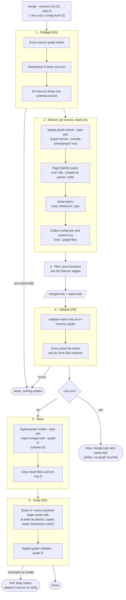
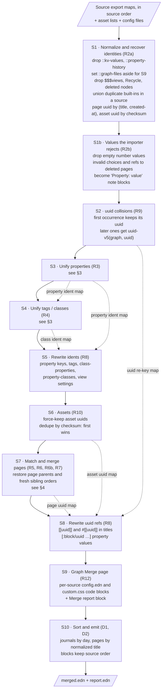
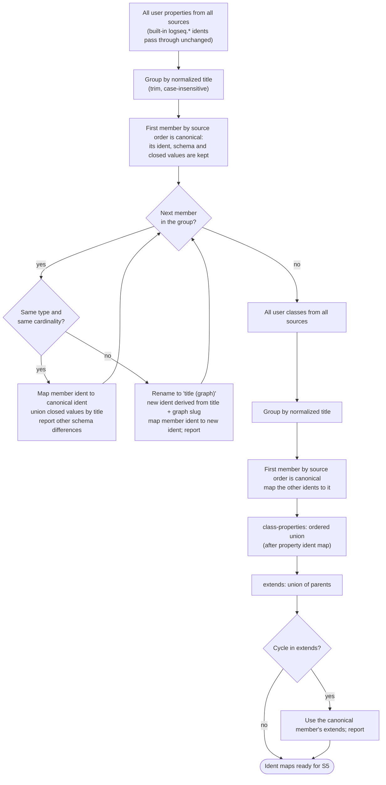
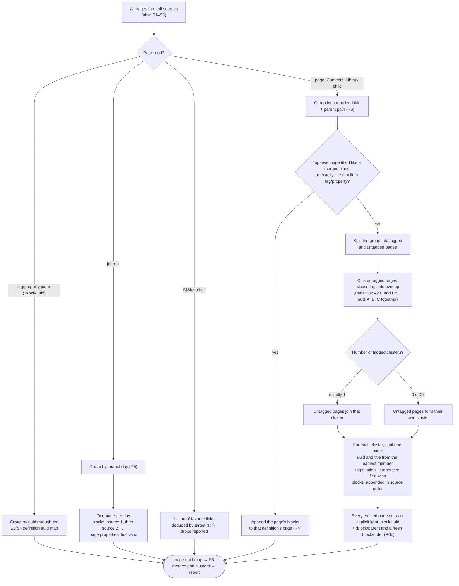

# Merge workflow

The diagrams below show how the merge works. `R*` and `D*` labels refer to [requirements.md](requirements.md).

The merge runs in six phases:

1. Preflight
2. Extract
3. Plan
4. Validate
5. Write
6. Verify

Phase 3, **Plan**, is made only of pure functions. It takes the source export maps and returns one merged export map plus a report, with no I/O. The planner is where all merge rules live and where the TDD tests focus.

## 1. End-to-end pipeline

The post-import count check is required: in the T3 spike, `graph import` exited 0 and printed "Imported" even though it had rejected the EDN and written nothing (trap 6).

The two queries in Extract exist because `:graph-human` drops page parents, page orders and unreferenced uuids (traps 4 and 9). S1 uses the query results to put those back.

## 2. Planner stages

Each stage is a pure function in its own namespace under `src/graph_merge/stage/`, composed by `graph-merge.plan/plan`. The stages run in this order because later stages use the maps built by earlier ones.

Every stage appends its decisions (renames, remaps, merges, skips, re-keys) to the shared report. S9 renders that report into the `Graph Merge` page.

## 3. Ontology unification (S3 and S4)

## 4. Page matching (S7)

Pages are **grouped first and resolved second**. The result therefore does not depend on which source a tagged or untagged page came from. Source order only decides precedence: which uuid, title spelling and page properties win.

Examples for one title and parent path:

| Source pages | Result |
|---|---|
| `Apple` (G1), `Apple` (G2) | 1 page, G1 blocks then G2 blocks |
| `Apple #Fruit` (G1), `Apple` (G2) | 1 page `Apple #Fruit`: one tagged cluster, so the untagged page joins it |
| `Apple` (G1), `Apple #Fruit` (G2) | Same as above; order doesn't matter |
| `Apple #Company` (G1), `Apple #Fruit` (G2) | 2 pages, kept separate |
| `Apple #Company` (G1), `Apple #Fruit` (G2), `Apple` (G3) | 3 pages: two tagged clusters, so the untagged page stays on its own |
| `Apple #Fruit` (G1), `Apple #Fruit #Food` (G2) | 1 page `Apple #Fruit #Food` |
